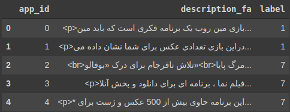

# Persian-App-Description-Classification-using-Transformers
Persian text classification - Classification of app descriptions in their categoriess using X-LMRoberta

The dataset I have worked on is comprised of real persian texts from CafeBazaar apps description and the apps categories. The objective for this projects is to **predict app categories** as accurately as possible. 

The texts consist of html tags, punctuations and emojies which need to be cleaned up before being fed to the model. I have done this task using regex library.

For the text classification, pretrained XLM-Roberta is used which is a very powerful language model trained on a large curpos of 104 languages, one of which is Persian. I have used Huggingface library to download the pretrained model and finetuned it on the task at hand.

The model is trained on the <code>train.csv</code> file and prediction of labels is done on the unlabeled <code>test.csv</code> file.